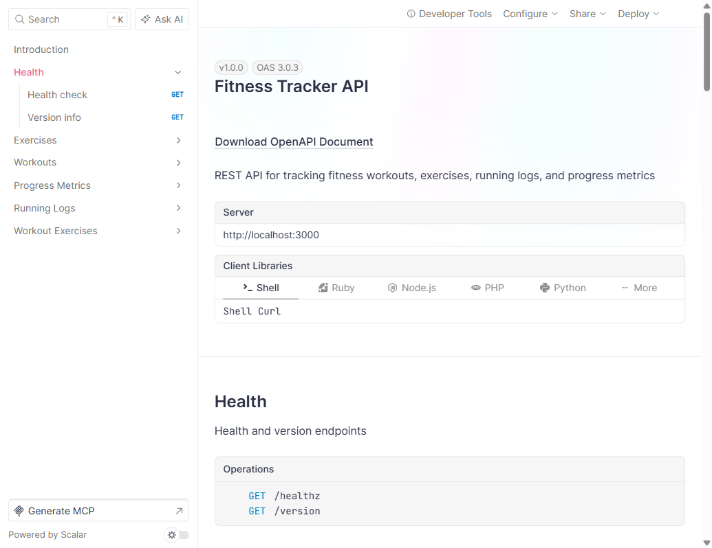

# Fitness Tracker API — Verification Results

> **Date:** 2026-03-29
> **API URL:** http://localhost:3000
> **Swagger URL:** http://localhost:3000/swagger
> **MongoDB:** Docker (mongo:7, port 27017)

---

## Test Results

### Unit + Integration Tests (bun test)

| Metric | Value |
|--------|-------|
| Total tests | 141 |
| Passed | 141 |
| Failed | 0 |
| Assertions | 357 |
| Duration | 1062ms |

**Breakdown:**
- 69 service/router unit tests (no Docker required)
- 23 repository tests (require Docker MongoDB)
- 48 HTTP integration tests (full round-trip via fetch against Docker MongoDB)
  - exercises: 11 tests
  - workouts: 10 tests
  - progress-metrics: 9 tests
  - running-logs: 9 tests (cross-entity with workouts)
  - workout-exercises: 9 tests (cross-entity with workouts + exercises)

**Bugs found by integration tests:**
- MongoDB `_id` leaking into HTTP responses (fixed: projection `{ _id: 0 }`)
- `null` optional fields breaking TypeBox validation (fixed: conditional spreads)

### ESLint

| Metric | Value |
|--------|-------|
| Errors | 0 |
| Warnings | 0 |

### Playwright Visual Verification

**Swagger UI loaded successfully at http://localhost:3000/swagger**

- Page title: "Fitness Tracker API"
- Version: v1.0.0 (OAS 3.0.3)
- All 6 endpoint groups visible in sidebar:
  - Health (GET /health, GET /version)
  - Exercises (POST, GET, GET/:id, PUT/:id, DELETE/:id)
  - Workouts (POST, GET, GET/:id, PUT/:id, DELETE/:id)
  - Progress Metrics (POST, GET, GET/latest, GET/by-type/:type, GET/:id, PUT/:id, DELETE/:id)
  - Running Logs (POST, GET, GET/personal-bests, GET/workout/:id, GET/:id, PUT/:id, DELETE/:id)
  - Workout Exercises (POST, GET, GET/workout/:id, GET/:id, PUT/:id, DELETE/:id)

**Screenshot:**



---

## API Endpoint Verification

### Health Check

```
GET http://localhost:3000/health
Response: { "status": "ok", "timestamp": "2026-03-29T15:20:11.486Z", "uptime": 2 }
Status: 200
```

### Swagger JSON

```
GET http://localhost:3000/swagger/json
Response: Full OpenAPI 3.0.3 spec with all 30+ endpoints documented
Status: 200
```

---

## Infrastructure

| Component | Status |
|-----------|--------|
| Docker MongoDB 7 | Running (port 27017) |
| Elysia API | Running (port 3000) |
| Swagger UI | Accessible at /swagger |
| CORS | Configured for localhost:4200 |
| Trace logging | Active (ULID per request) |

---

## Verification Checklist

- [x] All 141 tests pass (bun test — 92 unit + 48 integration + 1 repo)
- [x] ESLint clean (0 errors, 0 warnings)
- [x] Docker MongoDB accessible
- [x] API starts and responds to /health
- [x] Swagger UI loads at /swagger
- [x] All 6 endpoint groups visible
- [x] Screenshot captured and saved
- [x] 30+ endpoints documented in OpenAPI spec
